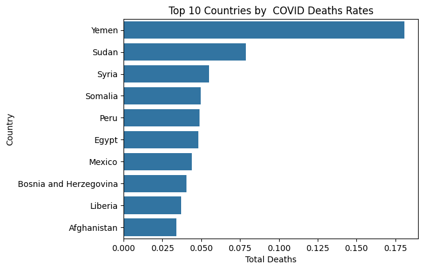

# COVID-19 Mortality Analysis

📊 **تحليل بصري وإحصائي لبيانات جائحة كورونا** باستخدام Python وGoogle Colab، مع التركيز على مقارنة **عدد الوفيات الإجمالي** و**معدل الوفيات** بين الدول.

## 📂 محتوى المشروع
- **تحليل إحصائي** لأعلى الدول من حيث عدد الوفيات.
- **مقارنة معدل الوفيات** (Deaths / Confirmed Cases).
- **رسوم بيانية** توضّح الفروقات بين الدول.
- **قراءة نقدية** لمدى ارتباط الأرقام بحجم الكارثة الحقيقية.

## 🔍 أهداف التحليل
1. التمييز بين **الأرقام المطلقة** و**النسب المئوية** في قياس الخطورة.
2. كشف الدول التي نجحت في احتواء الجائحة رغم عدد إصابات مرتفع.
3. إبراز دور البنية التحتية والسرعة في الاستجابة الصحية.

## 📊 التقنيات والأدوات
- Python
- Pandas, Matplotlib, Seaborn
- Google Colab
- بيانات من [Our World in Data](https://ourworldindata.org/coronavirus)

## 🚀 طريقة التشغيل
1. افتح ملف `covid19_analysis.ipynb` على [Google Colab](https://colab.research.google.com/).
2. ثبّت المكتبات المطلوبة:
   ```python
   pip install pandas matplotlib seaborn

## 📊 مخرجات التحليل

**أعلى 10 دول من حيث إجمالي الوفيات:**


**أعلى 10 دول من حيث معدل الوفيات:**


**Salma Alyossef** – محللة بيانات تهتم بتحويل الأرقام إلى قصص ورؤى عملية.

📌 **التواصل:**
LinkedIn(https://www.linkedin.com/in/salma-alyossef-586a951ab)


💡 *"الأرقام تتحدث، ومهمتي أن أجعل قصتها مسموعة."*
